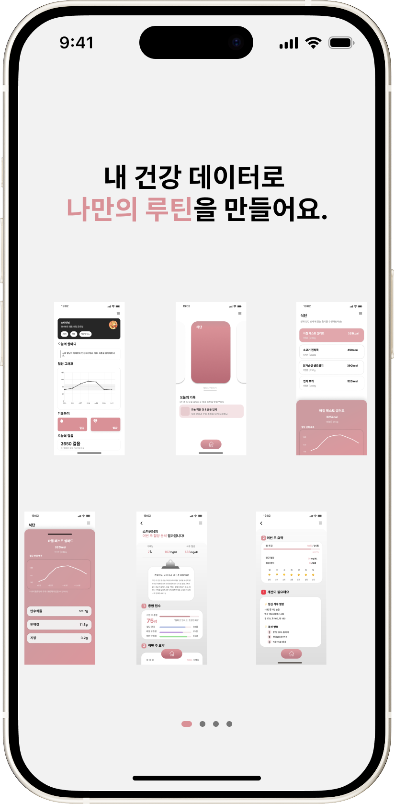
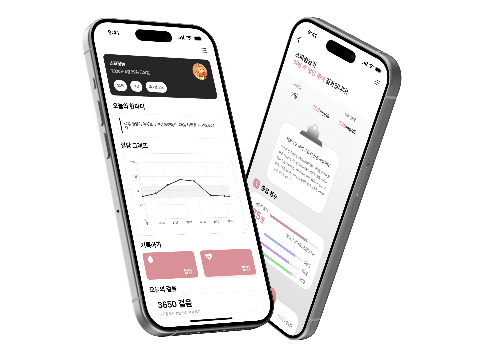
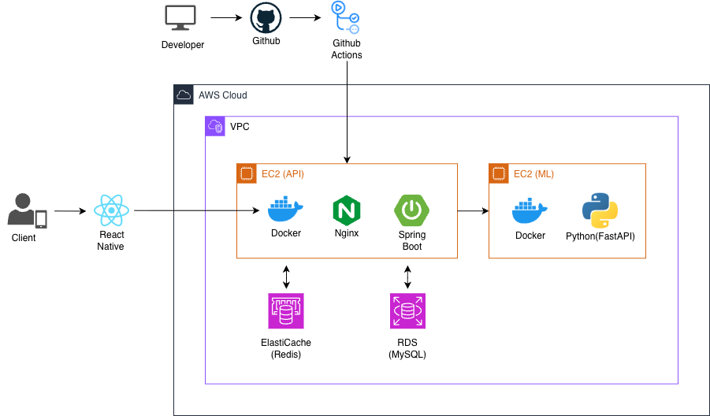

# 🩸 Don't Let Your Blood Spark!

 

<table width="90%">
<tr>

<td align="center" width="48%">

  

  

</td>

<td valign="middle" align="left" width="52%">

### 나의 건강 시그널을 확인하고 싶다면?  
### 지금, Sparring과 함께 시작해요.

  

🏥 **AI Healthcare Platform**  
  
👥 **Team Kangaroo**  
  
📆 **Development Period · 9 Months**

  

<a href="https://www.youtube.com/watch?v=XU9N04qXjIs">
  🖥️ <b>Watch Sparring Demo</b>
</a>

</td>

</tr>
</table>

---

# 👩🏻‍💻 Team Kangaroo

> **INU-Kangaroo**는 AI와 헬스케어 기술을 기반으로  
> 사용자 맞춤형 건강 관리 서비스를 개발하는 팀입니다.

 

| Name | Role |
| --- | --- |
| 👩🏻‍🦱 김도은 | AI Developer |
| 👱🏻‍♀️ 김예은 | Frontend Developer |
| 👩🏻 박은산 | Frontend Developer |
| 👩🏻‍🦳 최정현 | Backend Developer |

---

# 🥊 About Sparring

**Sparring**은 사용자의 건강 데이터를 기반으로  
식후 혈당 변화를 예측하고,  
개인 맞춤형 건강 피드백을 제공하는  
AI 기반 헬스케어 플랫폼입니다.

 

## ✨ Main Features

- 🩸 식후 혈당 변화 예측
- 📊 건강 데이터 시각화
- ⚙️ AI 기반 맞춤 건강 피드백
- 👣 지속 가능한 건강 습관 관리

---

# 📱 Preview

---

# 🧩 System Architecture

---

## 🩸 Don't Let Your Blood Spark

#### AI와 함께하는 스마트 헬스케어 플랫폼  
### <b>Sparring</b>

